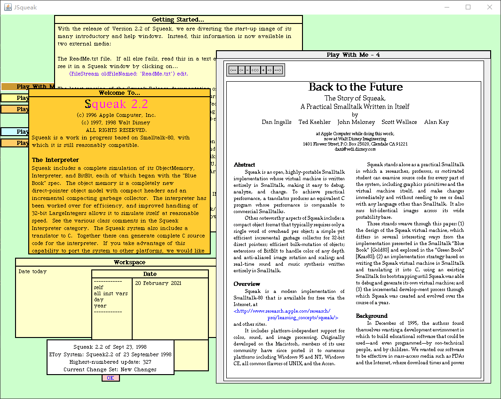

# JSqueak -- Java implementation of the Squeak Smalltalk Virtual Machine

**This is a fork of JSqueak**

JSqueak is a Java implementation of the Squeak Smalltalk virtual machine, originally 
developed by Daniel H. H. Ingalls at Sun Microsystems.

The (original) site of JSqueak is deprecated: 
http://research.sun.com/projects/JSqueak 

An archive site maintained by ESUG (European Smalltalk User Group) can be found in here: 
http://www.esug.org/data/Smalltalk/Squeak/JSqueak/local.html

This repository is forked from repository of Victor Rodriguez: 
https://github.com/victorr/jsqueak

I have upstreamed major changes from mine [ricky9090/jsqueak](https://github.com/ricky9090/jsqueak) to victorr/jsqueak.

## Progress

With my changes/improvements to the project, now JSqueak can load and run a full version Squeak 2.2 image (but crashes easily).

### Notable changes / improvements:
* Fix floating-point number issue. Now JSqueak can read floating-point numbers from image file correctly. 
  To verify this issue, try to move/resize the "Welcome to Mini Squeak 2.2" window (in mini.image).
* Reduce input lag by using a separate thread to notify input event.
* Beta support for (Main)Window resizing (Have to do "restore display" x2 manually after resizing).
* Beta support for 8/32 color depth (Also have to "restore display" manually).

### TODO
I'm planning to add more improvements to this project:

* Adding support for more color depth, and fix bugs related to display
* More primitive implementations
* Support for image saving
* Code refactoring and performance optimization
* **and more ...**

## Other derivative/fork of JSqueak
**Potato VM** 
Developed by HPI (Hasso-Plattner-Institut), with many new features & improvements 
Introduction: http://www.hpi.uni-potsdam.de/hirschfeld/projects/potato/index.html  
Announcement: https://news.squeak.org/2008/07/07/potato-version-of-jsqueak-from-hpi/  
Document: http://potatovm.blogspot.com/  
Source code: https://sourceforge.net/p/potatovm/code  

**victorr/jsqueak** 
Unofficial repository for JSqueak, maintained by Victor Rodriguez,  
he also participated in Potato's development. See: [AUTHORS](https://sourceforge.net/p/potatovm/code/HEAD/tree/trunk/AUTHORS)  
https://github.com/victorr/jsqueak

**jan-tomsa/jsqueak** 
A fork maintained by Jan Tomsa, with bug fixing and refactoring. 
https://github.com/jan-tomsa/jsqueak

**daitangio/jsqueak** 
Developed by Giovanni Giorgi, merged with the work from Jan Tomsa and the potato 
https://github.com/daitangio/jsqueak

## Useful Materials & References

**Squeak Official WebSite** 
https://squeak.org/

**Pharo Official WebSite** 
https://pharo.org/

**Here you can download the old versions of Squeak** 
http://files.squeak.org/

**For Squeak 2.2** source code and its VM implementation translated into the C language  
http://files.squeak.org/2.2/2.2.tar.gz

**Back to the Future: The Story of Squeak, A Practical Smalltalk Written in Itself** 
The original paper of Squeak Smalltalk. (HTML version) 
http://files.squeak.org/docs/OOPSLA.Squeak.html

**Smalltalk-80: The Language and its Implementation** (aka The BlueBook) 
http://stephane.ducasse.free.fr/FreeBooks/BlueBook/Bluebook.pdf

**ESUG (European Smalltalk User Group)** 
http://www.esug.org/

**Smalltalk-Archive collected by ESUG, include:** 
* Slides and Videos from past ESUG conferences
* Papers and Articles sponsored
* interesting historical artefacts and papers

http://esug.org/data/

**codefrau/SqueakJS** 
An HTML5 runtime engine for Squeak Smalltalk written in pure JavaScript by Vanessa Freudenberg. 
https://github.com/codefrau/SqueakJS

**devhawala/ST80** 
A Smalltalk-80 virtual machine by Dr. Hans-Walter Latz. Based on the "Bluebook" specification, implemented in Java 8. 
https://github.com/devhawala/ST80

**dbanay/Smalltalk** 
A C++ implementation of the Smalltalk-80 system by Dan Banay 
https://github.com/dbanay/Smalltalk

## License
JSqueak was released under the MIT license   
(see https://news.squeak.org/2008/06/21/jsqueak-smalltalk-interpreter-written-in-java).

